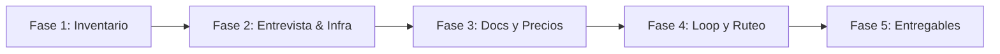

# 🧭 Orquestador de Vibe Coding

> **Convierte cualquier repositorio, tu infraestructura y tu presupuesto en un plan de ejecución de ingeniería de software con ruteo de modelos, arnés de pruebas (harness), loops de agentes e higiene de contexto.**

---

## 🎯 ¿Qué es esta skill?

El desarrollo asistido por IA (*vibe coding*) a menudo cae en dos extremos ineficientes:
1. **Desperdicio de cupo y dinero**: usar modelos frontera de razonamiento profundo (como Claude 3.7 Sonnet con thinking, o GPT-4.5) para escribir DTOs, boilerplate o tests repetitivos.
2. **Degradación de calidad**: usar modelos ligeros o baratos para arquitectura, lógica financiera o seguridad, terminando en horas de depuración manual.

Esta **skill** analiza un repositorio local o remoto, evalúa la **infraestructura del desarrollador**, consulta los **precios oficiales vigentes** de las herramientas y genera un **plan de orquestación a medida** con una estrategia de bucle determinista (*Harness o Loop*).

---

## ⚡ Principio fundamental

> **"Nunca afirmes un límite, precio, nombre de modelo o cuota desde memoria."**

Las tarifas, ventanas rodantes, créditos y catálogos de modelos cambian constantemente. Toda recomendación numérica en esta skill se obtiene en tiempo real consultando la documentación oficial y páginas de precios mediante navegación/búsqueda web, o se marca explícitamente para verificación.

---

## 📁 Estructura del Repositorio

```text
orquestador-vibe-coding/
├── SKILL.md                 # Definición de la skill, frontmatter y orquestación de 5 fases
├── README.md                # Documentación del proyecto y guía de uso
├── .gitignore               # Exclusiones de Git
├── assets/
│   └── tablero.html         # Plantilla interactiva del tablero HTML visual
├── references/
│   ├── contexto.md          # Protocolos /clear, /compact, caché de prefijos y handoff
│   ├── estrategias.md       # Estrategias decisivas: Test Harness Loop, Spec-Driven, Evaluator
│   ├── herramientas.md      # Registro de herramientas, pricing oficial y modelos locales
│   └── ruteo.md             # Taxonomía de tareas, matriz riesgo vs volumen y escalamiento
└── scripts/
    ├── empaquetar.ps1       # Empaquetador nativo en PowerShell (.zip)
    ├── empaquetar.sh        # Empaquetador nativo en Bash (.zip)
    └── inventario.sh        # Script determinista para analizar tamaño, tests y configs
```

---

## 🔁 Estrategias Decisivas de Vibe Coding (Harness & Loops)

El vibe coding sin un bucle cerrado de verificación produce acumulación de errores en cascada. La skill evalúa el repo y asigna una de las siguientes estrategias fundamentales:

### 1. Test Harness Loop (Arnés de Pruebas Automatizado)
* **Principio**: El agente nunca entrega código sin que el harness local lo valide.
* **Flujo**: Generar código → Ejecutar Harness (`tests + linter + typecheck` en <30s) → Corregir si falla → Commit atómico al pasar.
* **Impacto**: Autonomía real del agente sin riesgo de regresiones silenciosas.

### 2. Spec-Driven Loop (Arquitectura desacoplada de la Implementación)
* **Principio**: *"El modelo más caro piensa; el modelo más barato pica código."*
* **Flujo**: Fase 1 con modelo frontera de razonamiento (`thinking` activado) para redactar el `PLAN.md` con checklist atómica → Fase 2 con modelo económico (DeepSeek V3 / Flash / Haiku) para implementar tarea por tarea contra la especificación.
* **Impacto**: Reduce entre un 60% y un 80% el consumo de tokens y cuotas.

### 3. Evaluator-Optimizer Loop (Dual-Agent / Generador vs Auditor)
* **Principio**: *"Nunca permitas que el mismo modelo que escribió el código sea el único que lo audite."*
* **Flujo**: Un agente implementa los cambios; un segundo agente independiente analiza el `git diff` buscando vulnerabilidades de seguridad, edge cases y adherencia a `AGENTS.md`.
* **Impacto**: Vital para código de alto riesgo (pasarelas de pago, permisos, auth, contratos inteligentes).

### 4. Context Reset Loop (Higiene contra el Context Rot)
* **Principio**: La degradación de contexto es la causa número uno de alucinaciones en sesiones largas.
* **Flujo**: Al completar cada tarea validada, se commitea en Git y se ejecuta `/clear` inmediatamente para restaurar la ventana limpia. Las decisiones persistentes se guardan en archivos del repo, nunca en el historial efímero del chat.

---

## 💰 Asesoría de Stack y Precios Oficiales (Opcional)

Si el desarrollador no tiene un stack definido o busca optimizar sus gastos mensuales, la skill activa el **Modo Asesoría**:
1. **Consulta en Vivo de Precios**: Revisa páginas de pricing vigentes de Anthropic, OpenAI, Cursor, Google One AI Premium, GitHub Copilot y OpenRouter.
2. **Evaluación de Infraestructura**:
   * **Sistema Operativo**: Adaptabilidad de herramientas CLI (Claude Code / Aider) según entorno (Windows nativo vs WSL2 vs macOS/Linux).
   * **Hardware Local (GPU/RAM)**: Si el equipo cuenta con Apple Silicon (32GB+ RAM) o GPU NVIDIA (16GB+ VRAM), recomienda modelos locales (Qwen 2.5 Coder 32B vía Ollama) a **$0.00 de costo** para tareas de volumen.
   * **Privacidad**: Identificación de requisitos empresariales para activar modos de no-retención de datos (Privacy Mode) o despliegues locales.
3. **Presupuesto y TCO Estimado**: Entrega recomendaciones agrupadas por perfiles (Low-Cost BYOK, Sweet Spot de $20-$40/mes, o Power User de $100+/mes).

---

## 🔄 El Flujo en 5 Fases



1. **Fase 1 — Inventario**: Ejecución de `inventario.sh` y lectura cualitativa (riesgo, volumen, bucle de tests).
2. **Fase 2 — Entrevista**: Modalidad (optimizar o recomendar stack), infraestructura (SO, hardware, privacidad) y cuellos de botella.
3. **Fase 3 — Docs y Precios**: Consulta en vivo de documentación, cuotas y tarifas oficiales.
4. **Fase 4 — Derivación**: Selección de la estrategia de vibe coding (Harness, Spec, Evaluator), matriz riesgo vs volumen y presupuesto.
5. **Fase 5 — Entregables**: Generación de `tablero-orquestacion.html`, `AGENTS.md`, `CLAUDE.md` y `plan-orquestacion.md`.

---

## 🛠️ Instalación y Uso

### En Antigravity IDE
1. Coloca esta carpeta en tu directorio de skills:
   - Global: `~/.gemini/config/skills/orquestador-vibe-coding`
   - O local en tu proyecto: `.agents/skills/orquestador-vibe-coding`
2. Invócala directamente en el chat con frases como:
   - *"Analiza mi repo y dime qué estrategia de vibe coding (harness o loop) debo aplicar"*
   - *"Recomiéndame las mejores herramientas y planes para este proyecto según precios oficiales"*
   - *"Crea mi AGENTS.md y optimiza mi gasto de tokens"*

### En Claude Code u otros asistentes
- Copia o enlaza `SKILL.md` y sus carpetas auxiliares (`references/`, `scripts/`, `assets/`) en el directorio de instrucciones o utilitarios de tu agente.

---

## 📦 Empaquetar para Gemini Spark, Claude Projects o Custom GPTs

Se incluyen dos empaquetadores deterministas que generan un archivo comprimido `.zip` con todos los archivos necesarios (excluyendo automáticamente `.git`, temporales y cachés):

### En Windows (PowerShell):
```powershell
.\scripts\empaquetar.ps1
# O especificando una ruta de salida:
.\scripts\empaquetar.ps1 -OutputFile "mi-orquestador.zip"
```

### En Linux / macOS / WSL (Bash):
```bash
bash scripts/empaquetar.sh
# O especificando una ruta de salida:
bash scripts/empaquetar.sh mi-orquestador.zip
```

El archivo resultante (`orquestador-vibe-coding.zip`) queda listo en la raíz del proyecto para cargarse directamente en la interfaz de **Gemini Spark**, **Claude Projects**, **OpenAI GPTs** o compartirse como artefacto.

---

## 💡 Buenas Prácticas

- **Una sola fuente de verdad**: Enlaza `.cursorrules` o instrucciones de otros editores a `AGENTS.md` mediante symlinks (`ln -s AGENTS.md .cursorrules`) para evitar discrepancias.
- **No duplicar en CLAUDE.md**: Si ya está en `AGENTS.md`, impórtalo con `@AGENTS.md` y añade en `CLAUDE.md` únicamente parámetros operativos del CLI de Claude.
- **Cero números inventados**: Si no puedes verificar un límite o precio en tiempo real, márcalo como *"[Por verificar en sitio oficial]"*.
