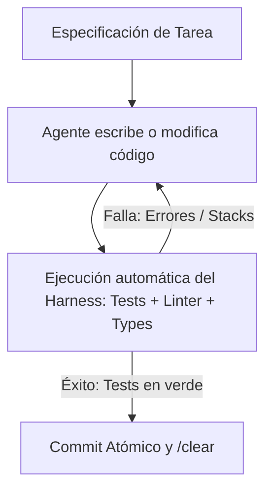

# Estrategias de Vibe Coding: Harness, Loops y Patrones Decisivos

El desarrollo guiado por agentes ("vibe coding") falla cuando se convierte en un chat abierto sin restricciones. Las estrategias a continuación transforman el vibe coding de un ejercicio caótico a un **flujo de ingeniería determinista**.

Durante la Fase 4 de la skill, selecciona la estrategia principal recomendada para el repositorio analizado en función de su infraestructura y madurez de tests.

---

## 1. El Test Harness Loop (Bucle de Arnés de Pruebas)

> *"Un agente sin bucle de retroalimentación es un generador de bugs con alta elocuencia."*

### En qué consiste
El agente no entrega código asumiendo que funciona: está obligado a iterar en un bucle cerrado local hasta que el arnés de pruebas dé luz verde.

### Requisitos de infraestructura
* **Velocidad de ejecución**: La suite de tests o el subconjunto unitario debe correr en **menos de 30 segundos**. Si toma 5 minutos, el agente consumirá la cuota esperando o abandonará el análisis.
* **Mocks y aislación**: No depender de APIs externas en vivo ni bases de datos de producción.

### Cuándo elegirla
* El repo ya cuenta con tests unitarios funcionales (`pytest`, `jest`, `vitest`, `go test`, `cargo test`).
* Tareas de refactorización, migración de dependencias o lógica de cálculo financiero/dominio.

---

## 2. El Spec-Driven Loop (Arquitectura desacoplada de la Implementación)

> *"El modelo más caro piensa; el modelo más barato pica código."*

### En qué consiste
Se divide el trabajo en dos etapas estrictamente separadas por un contrato escrito:

1. **Fase de Especificación (Spec/RFC)**:
   * Se ejecuta con un modelo frontera de razonamiento (`thinking / reasoning` activado).
   * El modelo lee el repo, define contratos de API, esquemas de datos, edge cases y crea un archivo de tareas atómicas (`TASKS.md` o checklist en el plan).
   * **Regla de oro**: En esta fase no se escribe una sola línea de código fuente.
2. **Fase de Implementación (Worker)**:
   * Se toma una tarea atómica a la vez.
   * Se asigna a un modelo económico (ej. DeepSeek V3, Claude 3.5 Haiku, Gemini Flash, GPT-4o-mini).
   * Cada tarea se valida y commitea de forma independiente.

### Cuándo elegirla
* Features nuevas de mediana o gran escala.
* Proyectos donde el presupuesto es limitado y se necesita estirar la suscripción o créditos al máximo.

---

## 3. El Evaluator-Optimizer Loop (Dual-Agent / Generador vs Crítico)

> *"Nunca permitas que el mismo modelo que escribió el código sea el único que lo audite."*

### En qué consiste
Un agente implementa la solución y un segundo agente (con prompt de auditoría o modelo distinto) revisa el diff contra directrices de seguridad, rendimiento y estándares de `AGENTS.md`.

* **Agente A (Generador)**: Diseña e implementa la feature.
* **Agente B (Auditor)**: Analiza el `git diff`, buscando fugas de memoria, inyecciones SQL, llamadas no asíncronas bloqueantes, o violaciones de arquitectura.
* Si el Auditor encuentra objeciones, devuelve el feedback al Generador antes de que el usuario intervenga.

### Cuándo elegirla
* Repositorios con alta sensibilidad de seguridad (autenticación, pagos, manejo de PII, smart contracts).
* Proyectos con equipos donde no hay un revisor humano senior disponible de inmediato.

---

## 4. El Context Reset Loop (Higiene de Micro-Sesiones)

> *"La degradación del contexto (context rot) es la causa #1 de código basura tras dos horas de sesión."*

### En qué consiste
A medida que la ventana de contexto crece con outputs de terminal y archivos leídos, la atención del modelo se dispersa, aumentando el riesgo de alucinaciones y el costo por token.

### Reglas operativas del Reset
1. **Una tarea = Una sesión**: Al terminar una tarea y pasar los tests, hacer `git commit` inmediato.
2. **`/clear` estricto**: Limpiar la memoria de la sesión antes de comenzar la siguiente tarea.
3. **Persistencia en disco, no en ventana**: Las decisiones y el estado se guardan en archivos del repo (`PROGRESS.md`, `AGENTS.md`, notas de sprint), nunca confiando en que el agente "lo recuerde" en el historial de conversación.

---

## Matriz de Selección de Estrategia

| Estrategia | Madurez del Repo | Infraestructura Requerida | Impacto Principal |
|---|---|---|---|
| **Test Harness Loop** | Alta (tiene tests) | Tests locales rápidos (<30s) | Cero regresiones y autonomía real |
| **Spec-Driven Loop** | Media / Cualquiera | Ninguna especial | Reducción de 60-80% en costo de tokens |
| **Evaluator-Optimizer** | Media / Alta | Múltiples modelos o subagentes | Seguridad y calidad arquitectónica |
| **Context Reset Loop** | Cualquiera | Git configurado | Prevención de context rot y ahorro de cuota |
